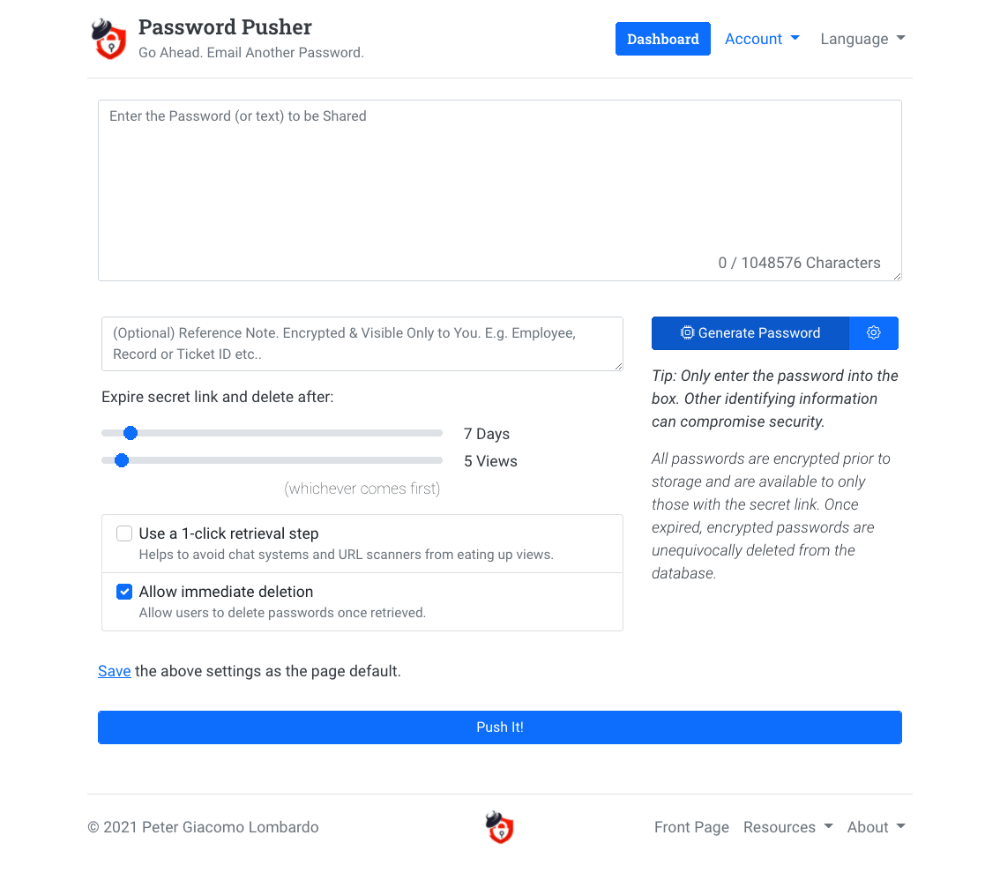

# Password Pusher CI/CD pipeline

Deploy Password Pusher server with CI/CD on Elestio

 
 

# Once deployed ...

You can open Password Pusher UI here:

    URL: https://[CI_CD_DOMAIN]
    email: [ADMIN_EMAIL]
    password: [ADMIN_PASSWORD]

You can open PHPMyAdmin web UI here:

    URL: https://[CI_CD_DOMAIN]:48846
    email: [ADMIN_EMAIL]
    password: [ADMIN_PASSWORD]
